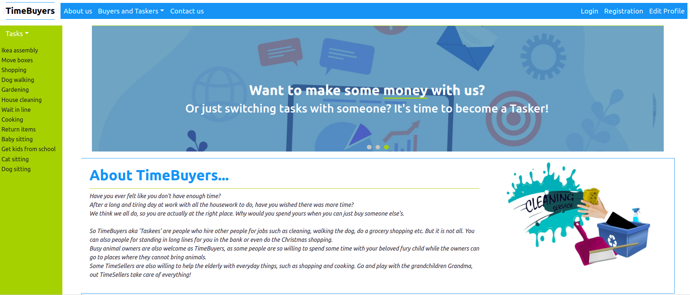
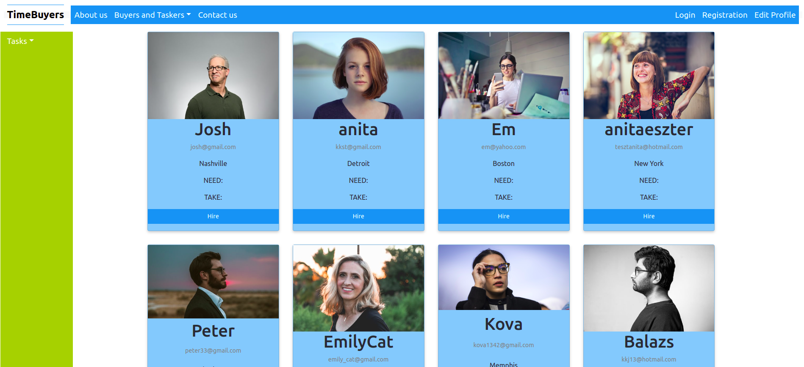

# TimeBuyers
- This is a Spring Boot application with React frontend, using PostgreSQL database. 
- It allows you to "buy time" for yourself. The registered user can hire other users (called Taskers) to do those tasks that she/he doesn't have enough time to do.

## Technology

- Spring Boot
- PostgreSQL
- CSS
- React

## Getting Started

- Clone the repository using the command git clone `https://github.com/kovesdieszter/TimeBuyers.git`.
- Install all necessary packages asked by your IDE.
- Add correct environment variables at Run-->Edit Configuration.
- You will have some user data on user cards if you import the data from 
     1. backend/main/resources/timebuyers_public_user_profile.csv. Click right on user_profile table --> Import Data from File.
     2. backend/main/resources/task_to_need.csv. Click right on tasks_to_need table --> Import Data from File.
     3. backend/main/resources/task_to_take.csv. Click right on tasks_to_take table --> Import Data from File.
- Run `TimeBuyersApplication.java` on backend.
- Run `npm start` command on frontend from the frontend/timebuyers directory.
